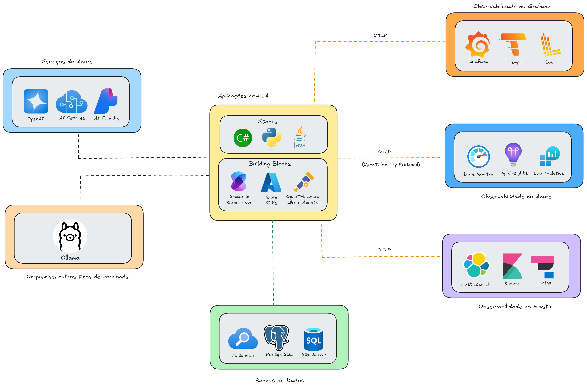
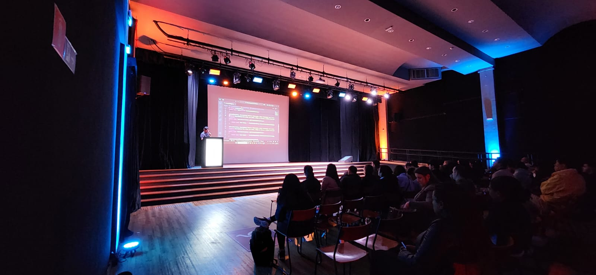
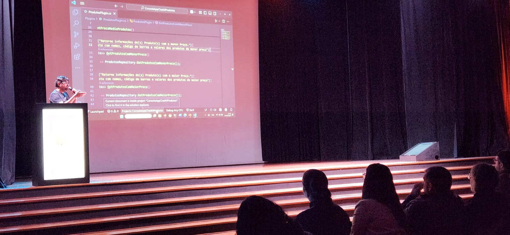
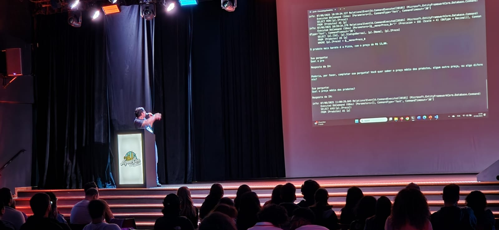
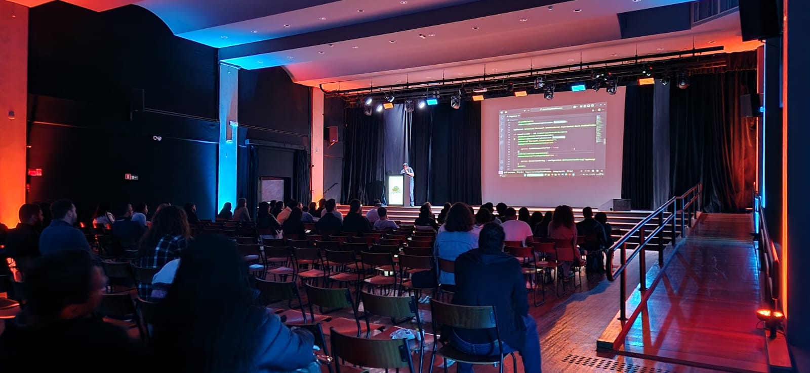
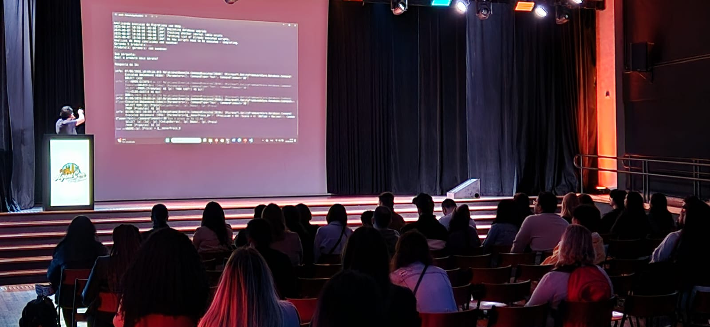
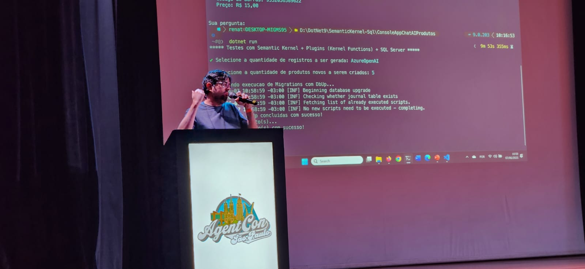
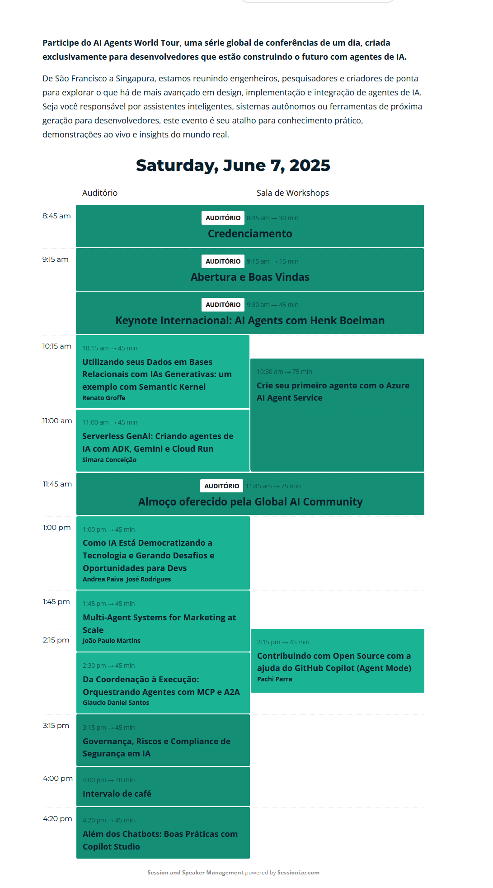
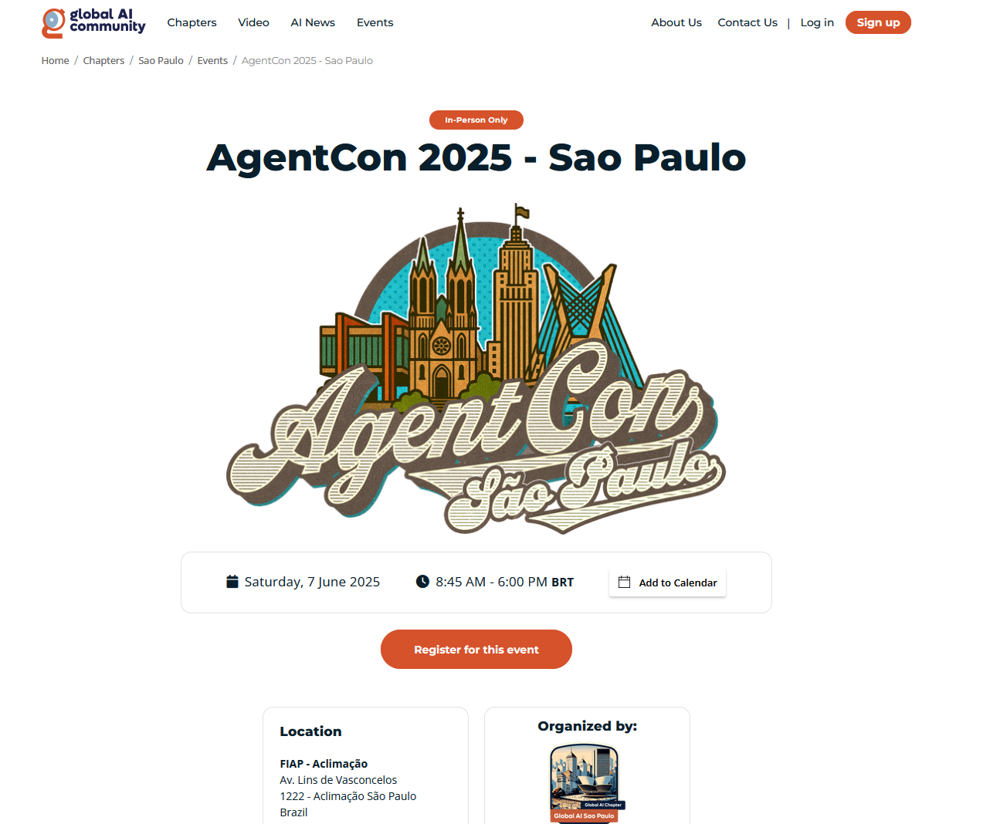
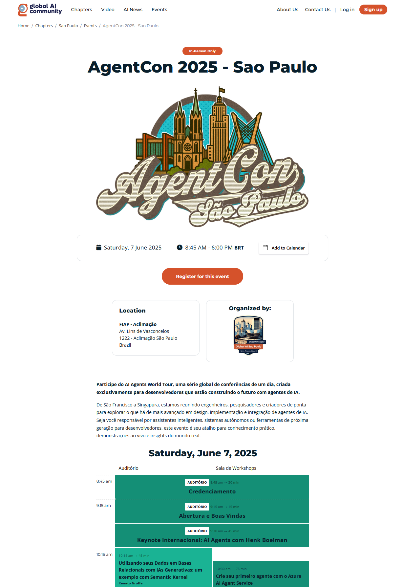

# semantickernel-dbs_agentcon2025-sp
Conteúdos sobre apresentação envolvendo o uso de Semantic Kernel. Palestra realizada durante o AgentCon 2025 em São Paulo-SP.

---

Exemplos de implementação - todos com OpenTelemetry + Semantic Kernel + .NET 9 + Azure OpenAI + Ollama + SQL Server/Azure SQL + Docker Compose:
- [Application Insights](https://github.com/renatogroffe/dotnet9-semantickernel-sqlserver-otel-azureappinsights_consultaprodutos)
- [Elastic APM](https://github.com/renatogroffe/dotnet9-semantickernel-sqlserver-otel-elasticapm_consultaprodutos)
- [Grafana](https://github.com/renatogroffe/dotnet9-semantickernel-sqlserver-otel-grafana_consultaprodutos)

Mais exemplos de implementação (todos utilizando OpenTelemetry + Semantic Kernel + .NET 9 + Azure OpenAI + Ollama + PostgreSQL + Docker Compose):
- [Application Insights](https://github.com/renatogroffe/dotnet9-semantickernel-postgres-otel-azureappinsights_consultaprodutos)
- [Elastic APM](https://github.com/renatogroffe/dotnet9-semantickernel-postgres-otel-elasticapm_consultaprodutos)
- [Grafana](https://github.com/renatogroffe/dotnet9-semantickernel-postgres-otel-grafana_consultaprodutos)
- [Jaeger](https://github.com/renatogroffe/dotnet9-semantickernel-postgres-otel-jaeger_consultaprodutos)

---

## Um exemplo de arquitetura

---

## Informações sobre o evento

Título da apresentação: **Utilizando seus Dados em Bases Relacionais com IAs Generativas: um exemplo com Semantic Kernel**

Descritivo: *Confira nesta apresentação como tirar proveito de forma descomplicada de seus dados que estejam em bases transacionais com aplicações que utilizem capacidades de inteligência artificiais generativas, seja um banco SQL Server, PostgreSQL, MySQL, Oracle... Tudo isso através do uso do projeto Semantic Kernel, uma alternativa extensível, facilmente integrável a aplicações .NET, Java e Python, além de compatível com os principais modelos de IA do mercado (incluindo suporte a Azure OpenAI, Llama...)!*

Evento: **AgentCon 2025 São Paulo**

Data: **07/06/2025 (sábado)**

Tecnologias e tópicos abordados: **.NET 9, Semantic Kernel, Azure OpenAI, Ollama, OpenTelemetry, Observabilidade, tecnologias cloud native, containers, Docker, Docker Compose, SQL Server, Azure SQL, PostgreSQL, MySQL, Oracle, Application Insights, Azure Monitor, Jaeger, Grafana, Grafana Tempo, Loki, Grafana Alloy, Zipkin, Elastic APM, Java, Visual Studio Code, Linux, Python...**

Número de participantes: **137 pessoas**

Página do evento: **https://globalai.community/chapters/sao-paulo/events/agentcon-2025-sao-paulo**

Local: **FIAP - Aclimação - Avenida Lins de Vasconcelos, 1222 - Aclimação - São Paulo-SP - CEP: 01538-001**

Acesse este [**link**](/img/) para visualizar todas as fotos/prints da apresentação.

Deixo aqui meus agradecimentos à **Cynthia Zanoni (Global Cloud Advocate - Microsoft, WoMakersCode)**, à **Larissa Cyganski (Microsoft Reactor)** e ao **Glaucio Daniel (Microsoft MVP)** por todo o apoio para que que participasse como palestrante do **AgentCon 2025 São Paulo**.

---

